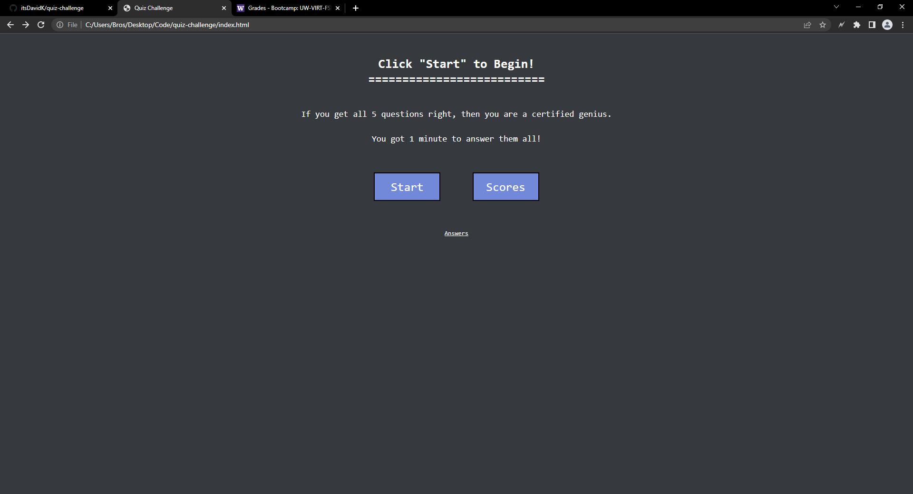
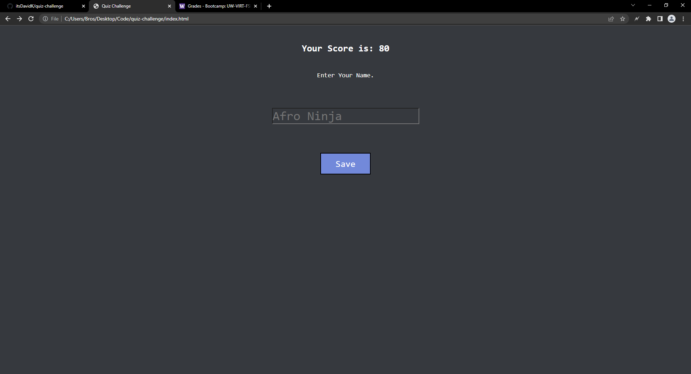
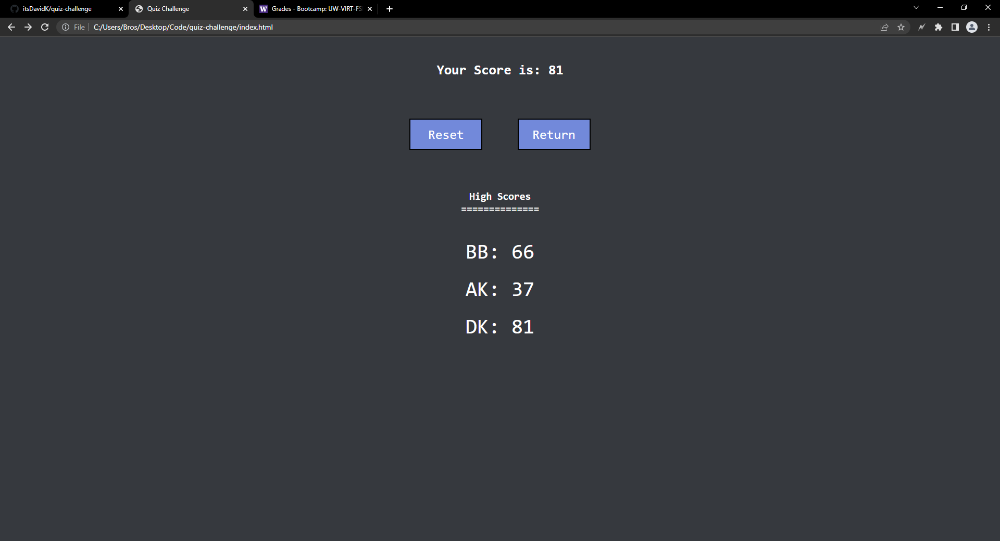
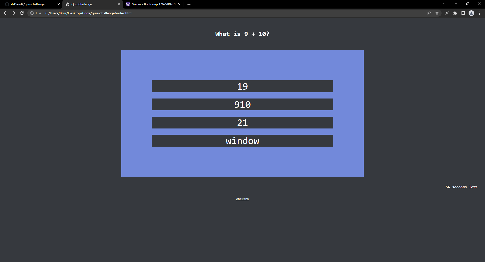

# quiz-challenge
Quiz-Challenge is a short quiz game designed using HTML, CSS, and Javascript. Using a nested array the questions and answers are stored to make a working quiz,
The user scores are saved in the local storage so that the user could come back to game and still see their previous scores.

## Contributing
Pull requests are welcome. For major changes, please open an issue first to discuss what you would like to change.

Please make sure to update tests as appropriate.

## Website Screenshot

## Link To The Website
https://itsdavidk.github.io/quiz-challenge
